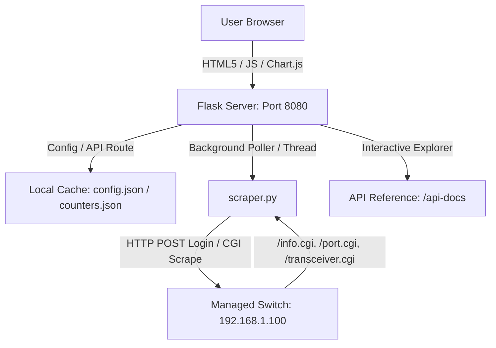

# 🌐 Switch Dashboard (HORACO & OEM Managed Switches)

A premium, high-performance, **real-time monitoring dashboard** designed for Managed Chiese Switches similar to HORACO HC-SWTGW218AS 8-Port + 2-Port SFP+ (10G) managed switches. The dashboard queries the switch’s native HTTP CGI interface, meaning **no SNMP setup or configuration is required**. 

Built with a gorgeous, high-tech glassmorphic dark-mode interface, it features automatic rolling bandwidth history, persistent byte-delta tracking, MAC address table searches, on-demand optical transceiver telemetry (DDMI), and a built-in interactive API explorer.

NOTE: This software is created in vibe coding using Antigravity/Gemini


This dashboarb support these device:
 - [HORACO HC-SWTGW218AS](https://www.byte4geek.com/go/hc-swtgw218as/)
 - [HORACO HC-SWTGW215AS](https://www.byte4geek.com/go/switch-hc-swtgw215as/)
 - [keepLink KP9000-9XH-X](https://www.byte4geek.com/go/kp9000-9xh-x/)

This tool support [RTLPlaygroung firmware](https://github.com/logicog/RTLPlayground) too.

---

## 🌟 Premium Features

### 1. High-Tech Glassmorphic Interface
* **Stunning Dark Mode**: Custom typography (Outfit/Inter/JetBrains Mono), harmonized color palettes, and frosted-glass components (`backdrop-filter: blur(12px)`) that look amazing on operations consoles.
* **Micro-Animations**: Dynamic state transitions, pulse loading indicators, and rotating refresh controls.
* **Adaptive Grid Layout**: Tailored viewports supporting smooth font scaling (S / M / L / XL) persisted directly to server settings.

### 2. SFP+ Transceiver Diagnostics & Telemetry (DDMI)
* **Real-time Optical Sensors**: Click the speed label of an SFP+ port (e.g. Port 9) to display physical module metadata (Vendor, Model, Serial, Compliances, Wavelength) and real-time DDMI diagnostics.
* **Visual Telemetry Bars**: Progress bars dynamically colored based on safe thresholds for:
  * **Temperature** (°C)
  * **Supply Voltage** (V)
  * **Bias Current** (mA)
  * **TX/RX Optical Power** (dBm)
* **Dynamic Refresh Loop**: Dedicated refresh button inside the modal to re-scrape physical hardware registers on-demand.
* **Bs4 Malformed Parsing Fix**: Custom pre-parsing sanitization engine handles malformed switch micro-controller HTML tables (like unclosed `<th>` tags closed by `</td>`), ensuring perfect parsing.


### 3. Interactive Bandwidth History Charts
* **Multi-Scale Sparklines**: Click any standard port speed to launch real-time bandwidth charts powered by **Chart.js**.
* **Three-Tier Historical Ranges**:
  * `Live` (High-resolution, real-time delta speed in bits per second)
  * `1-Hour` (Rolling 1-hour average in Bytes per second)
  * `24-Hour` (Rolling 24-hour average in 15-minute windows)

### 4. Advanced MAC Forwarding Table
* **Flexible Search & Filtering**: Multi-column text filtering makes searching by VLAN, Port, MAC, or status trivial.
* **Interactive Height Controls**: Dynamically drag to resize table heights (saves user preference to `settings.json` on disk).
* **Manual Re-indexing**: On-demand POST request scraper forces active switches to dump fresh bridge routing entries.


### 5. Configurator & Persistent Store
* **Multi-Switch Panel**: Dynamically add, modify, or delete switches through a beautifully organized `/config` route.
* **Persistent Accumulation**: Standard bytes counters are persistent across server reboots, complete with a delta tracking script to auto-detect and compensate for switch physical reboots without corrupting traffic metrics.
* **Annotation Layer**: Add custom, persistent labels/notes (e.g., "Uplink to NAS", "SmartTV") to any port.

### 6. Interactive Developer API Reference
* **Built-in Docs**: Hosted locally at `/api-docs` with a beautiful, fast sidebar navigation.
* **Developer Resources**: Contains interactive code cards, response payload previews, parameter grids, and copy-to-clipboard buttons for instant cURL examples.

### 7. DHCP Snooping & IGMP Snooping Telemetry
* **Global Configuration Tracking**: Scrapes global enable state for DHCP Snooping and IGMP Snooping, rendering status badges directly on the dashboard.
* **Port-Level Trust Badges**: Real-time port trust classifications are fetched from `/port.cgi` to show customized untrusted and trusted labels.
* **IGMP Multicast Tables**: Fully parsed multicast group database extracted from `/igmp.cgi?page=dump` displayed in an expandable glassmorphic table.

### 8. Jumbo Frame Configuration Status & Size
* **Frame Size Scraper**: Inspects `/fwd.cgi?page=jumboframe` to retrieve Jumbo Frame configuration status and parse the exact selected frame size (e.g. `9216Bytes`).

### 9. Server-Side Configuration Backups Manager
* **Config Backups**: Safely triggers configuration archive downloads via `/config_back.cgi?cmd=conf_backup`, storing them directly on the server's disk space.
* **Interactive Manager**: Beautiful `/backups` interface listing saved configs with quick downloads and single-click deletions protected by glassmorphic modal dialogues.

### 10. Secure Device Reboot Modal
* **Remote Power Cycle**: Triggers a remote switch reboot via `/reboot.cgi` securely.
* **Safety Confirmation**: Uses an immersive custom warning card modal using frosted glass backdrop effects, with real-time feedback loops during reboot execution.

### 11. Interactive Network Topology Map
* **Cubic Bezier Routing**: Interactive network map displaying real-time physical topology with cubic Bezier curved cables. Source and target port badges track the lines dynamically as you drag nodes.
* **Smart Device Grouping**: Automatically structures the layout using a levels-based tree schema: Router/Gateway -> Core Managed Switches -> Unmanaged/Virtual Switches -> Repeaters/APs -> Client Devices.
* **Persistent Layout Storage**: Drag-and-drop to position your network devices exactly where you want them. Coordinates are saved directly to `config.json` on the server.

---

## 🕸️ Network Map Topology & Device Grouping Guide

The dashboard automatically parses the learned MAC forwarding tables to construct a complete, visual topology map of your network (accessible at `/map`). By combining managed switch configurations with custom infrastructure devices, you can group and segment devices:


### 1. Router / Gateway (Root)
* **What it does**: Represents the main internet gateway or firewall. It serves as the root node of the layout.
* **How to configure**: Navigate to `/config` and under **Infrastructure Devices**, click **+ Add Infrastructure Device**. Set the type to **Router/Gateway** and enter its MAC address. 
* **Layout result**: The router will be drawn at the very top level, with uplinks radiating down to the managed core switches.

### 2. Repeaters / Access Points
* **What it does**: Represents WiFi access points or range extenders that have wireless clients associated with them.
* **How to configure**: Under **Infrastructure Devices**, click **+ Add Infrastructure Device**. Set the type to **Repeater/AP** and enter its MAC address.
* **Layout result**: Any client device whose MAC address is learned on the same managed switch port as the Repeater will automatically branch under the Repeater node instead of being linked directly to the switch port. This correctly represents wireless clients grouped under their AP.

### 3. Unmanaged / Virtual Switches
* **What it does**: Represents a physical unmanaged switch (or a dummy switch) connected to a specific managed switch port. All devices connected to this unmanaged switch will be grouped under it.
* **How to configure**: Under **Unmanaged Switches**, click **+ Add Unmanaged Switch**. Specify:
  * **Name**: The display name for the unmanaged switch (e.g. "Desk Switch").
  * **Parent Switch**: Select the managed parent switch from the dropdown.
  * **Parent Port**: Specify the port number where the unmanaged switch is connected.
* **Layout result**: All clients and infrastructure devices (like repeaters) learned on that managed parent port will automatically link to the unmanaged switch node. The unmanaged switch is then uplinked to the parent managed switch port.

### 4. Switch Monitoring Deactivation
* **What it does**: Stops querying a specific switch (reducing CGI page polling load) and completely hides it and its downstream devices from view.
* **How to configure**: In the **Switches** section, toggle the **Enabled** slider checkbox to off.
* **Layout result**: The switch disappears from both the main dashboard and the network map. Any offline client devices whose last known location was this disabled switch are automatically filtered out to prevent orphan floating nodes.

---

## 🎛️ Proxmox OVS Integration & Installation Guide

The Switch Dashboard supports monitoring virtual networking via **Open vSwitch (OVS)** running on a Proxmox VE host. This allows you to view LXC containers and VM interfaces connected to your virtual bridges directly in your network map and tables.

Follow the steps below to install OVS on your Proxmox host, configure the virtual bridge, set up a dedicated monitoring user with restricted sudo permissions, and integrate it into the dashboard.

### 1. Install OVS on the Proxmox VE Host
Log in to your Proxmox VE host via SSH as `root` (or a user with sudo privileges) and run:
```bash
sudo apt update && sudo apt install openvswitch-switch -y
```

### 2. Configure the OVS Bridge in the Proxmox Web GUI
To migrate from a standard Linux bridge to an OVS bridge:
1. Access the **Proxmox Web GUI** (`https://<your-proxmox-ip>:8006`).
2. Go to **Datacenter** -> **[Your Node]** -> **System** -> **Network**.
3. Select the default Linux bridge (usually `vmbr0`) and click **Remove**. *(Note: This staging action will not disconnect you immediately).*
4. Click **Create** -> Select **OVS Bridge**.
5. Configure the new OVS Bridge:
   - **Name**: `vmbr0`
   - **IPv4/CIDR**: `192.168.1.15/24` (use the IP address of your Proxmox host)
   - **Gateway (IPv4)**: `192.168.1.1` (your network gateway)
   - **Bridge Ports**: `enp3s0` (your physical network interface name)
6. Click **Apply Configuration** to commit the staged changes. The network configuration will reload instantly, switching the backend to Open vSwitch without restarting the host.

### 3. Create a Dedicated SSH Monitoring User on Proxmox
The Switch Dashboard retrieves statistics securely over SSH. Instead of using the `root` account, create a dedicated system user:
1. Add the user `ovs-monitor` on the Proxmox host:
   ```bash
   sudo adduser ovs-monitor
   ```
   Follow the prompts to configure a strong password.
2. Grant the user restricted passwordless sudo privileges. Edit the sudoers configuration:
   ```bash
   sudo visudo
   ```
   Append the following line at the end of the file:
   ```text
   ovs-monitor ALL=(ALL) NOPASSWD: /usr/bin/ovs-vsctl, /usr/bin/ovs-ofctl, /usr/bin/ovs-appctl, /usr/sbin/pct, /usr/sbin/qm
   ```
   *(Ensure these paths match the locations of the commands on your Proxmox host. You can verify them with `which ovs-vsctl pct qm`)*

### 4. Configure the OVS Integration in Switch Dashboard
You can add the OVS switch from the dashboard's `/config` web interface or directly in `config.json` by adding a switch object with `"model": "openvswitch"` or `"model": "ovs"`:
```json
{
  "name": "Proxmox OVS",
  "ip": "192.168.1.15",
  "username": "ovs-monitor",
  "password": "your-password-here",
  "model": "openvswitch",
  "bridge": "vmbr0",
  "port_count": 24
}
```

---

## Proxmox VE Cluster Driver

The `proxmox` driver uses the Proxmox VE HTTPS API to discover every physical cluster member, QEMU VM, and LXC container in a cluster. Add one **Virtualisation Host** per Proxmox cluster. That configuration record acts as a polling hub and is not itself rendered as network hardware. Each physical member appears separately on the network map, and guests are grouped around the member on which they currently run. Guest details include their VMID, state, resource usage, bridges, VLAN tags, and configured MAC addresses.

### Create a Read-Only API Token

Run these commands on a Proxmox node. The token secret is displayed only once:

```bash
pveum user add dashboard@pve
pveum acl modify / -user dashboard@pve -role PVEAuditor
pveum user token add dashboard@pve switch-dashboard --privsep 1
pveum acl modify / -token 'dashboard@pve!switch-dashboard' -role PVEAuditor
```

Configure the device through `/config`, select **Virtualisation Host** and **Proxmox VE (API Token)**, or add it directly:

```json
{
  "id": "production-cluster",
  "name": "Production Proxmox Cluster",
  "ip": "192.168.1.20",
  "management_type": "managed",
  "role": "virtualisation_host",
  "device_type": "virtualisation_host",
  "protocol": "proxmox",
  "model": "proxmox",
  "api_user": "dashboard@pve",
  "token_id": "switch-dashboard",
  "token_secret": "TOKEN-SECRET",
  "api_port": 8006,
  "api_timeout": 15,
  "verify_ssl": true,
  "ca_bundle": "",
  "max_concurrency": 10,
  "enabled": true
}
```

TLS verification is enabled by default. Use `ca_bundle` for a private CA certificate. Disable `verify_ssl` only when the certificate cannot be validated and the security tradeoff is understood.

The configured endpoint can be any reachable cluster member; inventory is collected cluster-wide. Configure only one endpoint for each cluster to avoid duplicate nodes. The driver reads `/nodes/{node}/network` and matches physical interface MAC addresses against managed switch forwarding tables. If Proxmox omits a hardware address, scanner inventory or an IP-aware ARP table can supply the IP-to-MAC match. VM/LXC IP addresses are shown only when available from guest configuration; the driver does not require or assume that the QEMU guest agent is installed. Guest inventory is currently live and is not persisted while the dashboard or Proxmox API is offline.

---

## Ubiquiti UniFi Standalone SSH Driver

Standalone UniFi switches, access points, and gateways can be monitored directly over SSH without a UniFi Network controller. The dedicated `unifi` driver reads the device's `mca-dump` output and normalizes port counters, link state, firmware, uptime, MAC forwarding entries, and LLDP neighbors for the dashboard.

Enable device SSH in the UniFi device settings first. Use the device-specific SSH credentials, not a UI.com account. Add the device through `/config` and select **Ubiquiti UniFi (Standalone SSH)**, or configure it directly:

```json
{
  "name": "Office UniFi Switch",
  "ip": "192.168.1.20",
  "protocol": "unifi",
  "model": "USW-Lite-8-PoE",
  "username": "ubnt",
  "password": "device-ssh-password",
  "ssh_port": 22,
  "strict_host_key": true,
  "port_count": 8,
  "enabled": true
}
```

With `strict_host_key` enabled, the dashboard service account must trust the device key. For example, run `ssh-keyscan -H 192.168.1.20 >> ~/.ssh/known_hosts` as that service account after verifying the fingerprint. If a verified device has been replaced or regenerated its key, remove the old entry with `ssh-keygen -R 192.168.1.20` before adding the new key. Set `strict_host_key` to `false` only when bypassing `known_hosts` verification is acceptable.

The default telemetry command is `mca-dump`. For switches without an embedded forwarding table, automatic MAC discovery tries `swctrl`, `ubntbox swctrl`, `bridge fdb`, and `brctl` in order. Set `mac_table_command` to a custom command or an empty value to disable that fallback. Access points use the `station_table` from `mca-dump` and do not run switch-only commands. This driver targets direct standalone-device SSH; controller-managed collection is not required.

## Generic SSH JSON Driver

The selectable `ssh` driver supports other SSH-managed network devices through user-provided commands. `scrape_command` is required and must print one JSON object to stdout. `mac_table_command` and `neighbors_command` are optional and must print JSON arrays. Commands must be non-interactive and available to the configured SSH account.

```json
{
  "name": "Custom SSH Switch",
  "ip": "192.168.1.30",
  "protocol": "ssh",
  "model": "custom-os",
  "username": "monitor",
  "key_filename": "/opt/switch-dashboard/.ssh/id_ed25519",
  "ssh_port": 22,
  "ssh_timeout": 10,
  "strict_host_key": true,
  "scrape_command": "/usr/local/bin/dashboard-status --json",
  "mac_table_command": "/usr/local/bin/dashboard-fdb --json",
  "neighbors_command": "/usr/local/bin/dashboard-lldp --json",
  "port_count": 24
}
```

The telemetry object supports `name`, `model`, `firmware`, `uptime`, `mac`, `status`, and `ports`. Each port should include `port` and `status`; omitted counters and display fields receive safe defaults:

```json
{
  "status": "online",
  "ports": [
    {
      "port": "1",
      "status": "up",
      "link": "Link Up",
      "speed": "1G",
      "duplex": "Full",
      "tx_bytes": 123456,
      "rx_bytes": 654321,
      "tx_packets": 1000,
      "rx_packets": 900
    }
  ]
}
```

MAC table entries use `{"mac":"00:11:22:33:44:55","port":"1","vlan":"1"}`. Neighbor entries use `{"local_port":"1","remote_chassis_id":"AA:BB:CC:DD:EE:FF","remote_port_id":"1","remote_system_name":"core-switch"}`. Invalid JSON or an unsuccessful SSH command marks telemetry offline rather than terminating the poller.

---

## 🛠️ System Architecture



* **Backend**: Flask (Python 3.9+), single-worker polling thread to prevent session thrashing.
* **Frontend**: Vanilla ES6 JS, Custom CSS (Aesthetic glassmorphism), Chart.js (multi-tier canvas).
* **Scraper**: Custom HTTP CookieJar scraper communicating with switch `/login.cgi`, `/info.cgi`, `/port.cgi?page=stats`, and `/transceiver.cgi`.

---

## 📦 Requirements

* **Python 3.9+**
* **Operating System**: Linux with `systemd` (Debian, Ubuntu, CentOS, Arch) or standalone Windows/macOS.
* **Network Access**: Port 80 access to HTTP-managed switches, TCP port 22 access to SSH/UniFi/OVS targets, and TCP port 8006 access to Proxmox VE as configured.

---

## 🚀 Installation & Deployment (Linux)

Our automated script handles the entire installation seamlessly, creating a dedicated Python virtual environment to avoid interfering with system packages.

### Automated Install

```bash
# Clone the repository
git clone https://github.com/byte4geek/switch-dashboard.git
cd switch-dashboard

# Run the installer as root
sudo bash install.sh
```

The script will:
1. Copy all project files to `/opt/switch-dashboard/`.
2. Check for system-level dependencies (`python3-pip`, `python3-venv`).
3. Set up a secure virtual environment inside `/opt/switch-dashboard/venv`.
4. Install all requirements (`Flask`, `BeautifulSoup4`).
5. Generate and register a `switch-dashboard.service` with `systemd`.
6. Start and enable the service on boot.

Once completed, the dashboard is live at:
* **Dashboard**: `http://<your-ip>:8080`
* **API Documentation**: `http://<your-ip>:8080/api-docs`
---

## 🐳 Docker Deployment

You can deploy the Switch Dashboard as a lightweight Docker container. All persistent configurations, history files, and switch backups are managed inside a single volume or host directory mapping.

### 💾 Persistent Data Mapping
The dashboard keeps its state in several files and a backup folder:
* **Configurations & Settings**: `config.json`, `settings.json`, `notes.json`
* **Bandwidth & Counters**: `counters.json`, `history_hourly.json`, `history_daily.json`
* **Switch Backups**: `/backup/` subdirectory

All of the above items are unified under the path specified by the `DASHBOARD_DATA_DIR` environment variable (defaults to `/data` in the container). You only need to mount/persist this single folder!

### Option A: Using Docker Compose (Recommended)

A pre-configured `docker-compose.yml` is provided in the repository.

1. **Clone the repository**:
   ```bash
   git clone https://github.com/byte4geek/switch-dashboard.git
   cd switch-dashboard
   ```

2. **Configure your switches**:
   You can either edit `config.json` before running the container, or simply let the container initialize the default `config.json` inside the mounted volume directory (`./data`), and then edit it there or via the dashboard's `/config` page.

3. **Start the container**:
   ```bash
   docker compose up -d
   ```

4. **Access the dashboard**:
   Go to `http://<your-ip>:8080` in your web browser. All your configs, notes, backups, and charts history will be persisted in the local `./data` folder on the host.

### Option B: Using Docker CLI

To run the container manually with the Docker CLI:

1. **Build the image**:
   ```bash
   docker build -t switch-dashboard .
   ```

2. **Run the container with a volume**:
   ```bash
   docker run -d \
     --name switch-dashboard \
     --restart unless-stopped \
     -p 8080:8080 \
     -v /absolute/path/to/your/data:/data \
     -e DASHBOARD_DATA_DIR=/data \
     switch-dashboard
   ```
   *Replace `/absolute/path/to/your/data` with the actual directory path on your host where you want to store your persistent data.*

---

## 🔌 Customizing with YAML Device Templates

The dashboard supports template-driven scraping. This enables users to add support for any managed switch model simply by writing a declarative YAML blueprint and placing it in the `./device-templates/` directory.

### How to Create a Template
A switch template is named `<model_name>.yaml` (where `<model_name>` matches the **model** field configured for the switch in `/config` or `config.json`).

Here is a complete reference of the YAML blueprint schema:

```yaml
model: "HC-SWTGW218AS"          # The exact switch model name
manufacturer: "Horaco"           # Brand/Manufacturer name

# 1. Device Global Information (from /info.cgi key-value tables)
device_info:
  url: "/info.cgi"
  method: "key_value_grid"
  mappings:
    uptime: "Sys Uptime"
    mac: "MAC Address"
    ip: "IP Address"
    firmware: "Firmware Version"
    model: "Device Model"

# 2. Port Link Settings & Statuses
ports:
  url: "/info.cgi"
  source: "info_table"           # "info_table" (Horaco style) or "port_table" (KeepLink style)
  columns:
    port: 0
    link: 1
    duplex: 2
    speed: 3
    flow_control: 4

# 3. Port Transmission/Reception counters
statistics:
  url: "/port.cgi?page=stats"
  method: "header_aware"
  terms:
    tx_packets: ["txgoodpkt", "txpackets", "tx packet", "txok"]
    rx_packets: ["rxgoodpkt", "rxpackets", "rx packet", "rxok"]
    tx_bytes: ["txbytes", "tx_bytes", "txgoodbytes"]
    rx_bytes: ["rxbytes", "rx_bytes", "rxgoodbytes"]

# 4. DHCP Snooping Status & Trusted Ports
dhcp_snooping:
  url: "/dhcp_snooping.cgi?page=dump"
  enable_input_name: "enable_dhcpsnp"
  ports_form_action: "page=static"
  trust_checkbox_class: "chkp"

# 5. IGMP Snooping Multicast Groups Table
igmp:
  url: "/igmp.cgi?page=dump"
  enable_input_name: "enable_igmp"
  table_header_keywords: ["IP Address", "Port", "VLAN ID"]

# 6. Jumbo Frame Parameter
jumbo_frame:
  url: "/fwd.cgi?page=jumboframe"
  enable_input_name: "enable_jumbo"
  select_name: "jumboframe"

# 7. MAC Address Forwarding Table (with paging)
mac_table:
  url: "/mac.cgi?page=fwd_tbl"
  page_parameter: "pageidx"
  perpage_parameter: "perpage"
  perpage_value: "3"
  cmd_parameter: "cmd"
  cmd_value: "goto"

# 8. CGI Configuration Backup download
backup:
  url: "/config_back.cgi?cmd=conf_backup"
  referer_path: "/config_back.cgi"
  method: "GET"

# 9. Switch Remote Reboot action
reboot:
  url: "/reboot.cgi"
  referer_path: "/reboot.cgi"
  method: "POST"
  post_data:
    cmd: "reboot"
```

### Adding Model Custom Graphics
To add a dedicated device photo or graphic to the switch card:
1. Place a `.png`, `.jpg`, or `.jpeg` file in the `./device-templates/` directory.
2. Name the file exactly after the switch model (e.g. `HC-SWTGW218AS.png`).
3. If no custom image is found, the system will seamlessly fall back to a beautifully stylized 8-port switch icon located at `/static/switch_icon.png`.

---

## 🔧 Manual Setup & Debugging

If you prefer to configure the dashboard manually or want to run it on non-systemd machines (Windows / macOS):

### 1. Install Dependencies
```bash
python3 -m venv venv
source venv/bin/activate
pip install -r requirements.txt
```

### 2. Configure Monitored Switches
Create or edit `/opt/switch-dashboard/config.json`:
```json
{
  "title": "Network Command Center",
  "refresh_interval": 10,
  "mac_refresh_multiplier": 5,
  "switches": [
    {
      "name": "HORACO Core",
      "ip": "192.168.1.100",
      "username": "admin",
      "password": "admin",
      "model": "HC-SWTGW218AS",
      "port_count": 9
    }
  ]
}
```

### 3. Run Standalone
```bash
python3 app.py
```

---

## 📋 REST API Reference

The dashboard includes a set of REST endpoints. For complete details, response payloads, and copyable cURL examples, navigate to the `/api-docs` route.

| Method | Endpoint | Description |
| :--- | :--- | :--- |
| `GET` | `/api/switches` | Returns live status of all switches and ports, including custom notes. |
| `GET` | `/api/switches/<ip>/transceiver` | Returns parsed SFP module diagnostics and DDMI telemetry. |
| `POST`| `/api/switches/<ip>/refresh_mac` | Forces an immediate scrape and returns the active MAC forwarding table. |
| `GET` | `/api/speeds` | Returns real-time delta speed states (Bytes/s, bps) for active interfaces. |
| `GET` | `/api/history` | Returns high-res historical statistics for Chart.js (`live`, `1h`, `24h`). |
| `POST`| `/api/notes` | Attaches a persistent label/description to a port (saves to `notes.json`). |
| `GET` | `/api/settings` | Retrieves global UI preferences (e.g., base font scale). |
| `POST`| `/api/settings` | Updates global UI settings on the disk. |
| `POST`| `/api/reset` | Purges cumulative logs and bandwidth cache, resetting delta Baselines. |
| `POST`| `/api/switches/<ip>/backup` | Triggers a configuration backup and saves the binary archive to the server's disk. |
| `POST`| `/api/switches/<ip>/reboot` | Safely sends a reboot trigger to the physical switch hardware. |
| `GET` | `/api/backups` | Lists all configuration backups stored on the server. |
| `GET` | `/api/backups/<filename>/download` | Downloads a specific saved switch configuration file. |
| `DELETE`| `/api/backups/<filename>` | Deletes a specific switch configuration file from the server. |
| `GET` | `/backups` | Returns the HTML template for the backups manager dashboard. |
| `GET`/`POST` | `/api/vendors` | Retrieves or saves custom MAC vendor mappings (`mac_vendors.txt`). |
| `POST`| `/api/vendors/update_oui` | Manually downloads and caches the official IEEE OUI and OUI-36 databases. |

---

## 📂 Project Structure

```
/opt/switch-dashboard/
├── app.py              # Flask core service, poller thread, and REST API routes
├── scraper.py          # Switch scraping engine, custom login cookie session, and tags cleaner
├── config.json         # User-defined switches, polling intervals, and general configuration
├── counters.json       # Persistent cumulative traffic database
├── notes.json          # Persistent custom port descriptions
├── settings.json       # Persisted user UI configurations (e.g. font sizes, table dimensions)
├── mac_vendors.txt     # Local custom OUI vendor names/overrides file
├── oui.txt             # Downloaded official IEEE OUI-24 database
├── oui36.txt           # Downloaded official IEEE OUI-36 database
├── install.sh          # Self-healing, multi-distro Linux automated systemd installer
├── requirements.txt    # Python package dependencies
├── templates/
│   ├── index.html      # Main high-tech glassmorphic dashboard
│   ├── config.html     # Switch configurator interface
│   └── api_docs.html   # Premium built-in developer documentation manual
└── static/
    ├── style.css       # Premium core CSS tokens, custom dark scrollbars, and layouts
    ├── app.js          # Core front-end logic, rendering engine, Chart.js mapping
    └── logo.png        # Horaco brand assets
```

---

## 🛡️ License

This project is licensed under the **MIT License**. Feel free to modify, distribute, or incorporate it into your network setup.

---

## 📅 Release Notes & Changelog

### 🚀 Release 2026.6.5 (Current)
* **🔀 Interactive Column Sorting (Subnet Scanner)**:
  - Added interactive ascending/descending sorting for all columns in the subnet scanner table.
  - Implemented custom numerical sorting for IP addresses, chronological sorting for date/time columns, and locale-aware alphanumeric sorting for textual columns.
  - Displays dynamic sorting indicators (`▲`/`▼`) next to active sorted headers, with built-in drag-resize protection.
* **🛡️ Proxy ARP / VPN IP Overwrite Protection & Deletion Reset**:
  - Implemented numerical IP sorting and scan priority logic to prevent local virtual WireGuard VPN alias IPs (like `.200` or `.201`) from overwriting the primary IP mapping (like `.1`) of gateways with multiple active IP responses.
  - Restructured deletion so that removing a client host sets `scanner_detected = False`, triggerring a fresh scan resolution to the primary IP.
* **⚙️ Discovery Concurrency & Timeout Customization**:
  - Re-engineered the background scanner utilizing `ThreadPoolExecutor` to scan multiple hosts concurrently.
  - Added millisecond timeout configuration (`scanner_port_scan_timeout_ms`) for fast port testing.
  - Added Host/Port Concurrency and Timeout parameters to the General settings card on `/config`.
* **⏱️ Live Auto-Refresh Countdowns & Smart Pausing**:
  - Integrated real-time 1-second countdown timers on the Dashboard, Network Scanner, and Network Map.
  - Added smart pausing to freeze updates and display `Paused` when editing input notes, nicknames, or when sidebar map inspect controls are focused.
* **📉 Column Visibility Cleanup & Cumulative Port Graphs**:
  - Completely removed the `raw_bytes` and `host` columns from the main dashboard tables and settings configuration.
  - Integrated a new **Cumulative Traffic** section inside the port graph modal overlay showing real-time cumulative TX and RX bytes, updating automatically every 30 seconds alongside the speed plot.
  - Added dynamic filtering protection in the frontend layout to ignore any invalid or deprecated column keys in `config.json`.
* **🎨 Visual Styling & API Documentation Overhaul**:
  - Standardized scrollbars and stylesheet themes in `templates/scanner_history.html`.
  - Expanded `/api-docs` to completely document all available REST API endpoints in the backend.

---

### 🚀 Release 2026.6.3
  - Implemented HTML5 drag-and-drop node reordering in the configuration settings page (`/config`), with a custom grab indicator handle `⠿`.
  - Dynamically recalculates and updates all internal DOM indices, hidden enable fields, checkbox toggles, and callbacks on drop to ensure form inputs stay synchronized.
  - Form submission saves switches to `config.json` in the new DOM order, and the main page `/` renders switch panels in the exact sequence configured.
* **🔌 Unified Port Speed Formats**:
  - Unified the representation of port speeds across all switch types (Open vSwitch, Fritz!Box, and Managed Switches).
  - Automatically translates raw bit speeds (like `2500M`, `1000M`) to unified speed labels (like `2.5G`, `1G`), aligning with standard virtual and router node speed conventions.
* **⏱️ Configurable Request Retries & HTTP 404 Optimization**:
  - Added a new `Max Request Retries` parameter in `/config` (General Settings) to customize switch query retries (set to 0 to disable retries).
  - Optimized the internal scraper retry engine to fail fast and abort retries immediately when encountering `HTTP 404 Not Found` errors, preventing thread blocking, scraping lag, and missing throughput charts.

---

### 🚀 Release 2026.6.2
* **🕸️ Interactive Network Topology Map**:
  - Implemented custom Bezier curve routing equations to position port badges precisely along cables during node drags.
  - Added layout reset confirmation dialogs in English to prevent accidental map layout clears.
  - Auto-expanded node card width calculations based on client names and sublabels.
* **🔌 Unmanaged Switches / Virtual Switches Support**:
  - Added support for defining unmanaged switches connected to specific ports of managed switches.
  - Automatically structures downstream devices (clients and repeaters) under the unmanaged switch node, enabling accurate client grouping.
* **🎛️ Configured Switch Deactivation**:
  - Added a switch deactivation toggle checkbox on the configuration page with a clean slider toggle styling.
  - Skips background scraping threads for disabled switches, purges their cached data, and hides them from the main index and network map.
  - Filters out orphan offline client devices whose last known parent switch is disabled to prevent scattering layout errors.

---

### 🚀 Release 2026.6.1
* **🌐 Dynamic MAC Address Vendor Resolution**:
  - Automatically matches MAC addresses to manufacturers using the official IEEE OUI registry (`oui.txt` and `oui36.txt`).
  - Added support for a custom MAC vendors file (`mac_vendors.txt`) mapping local MAC prefixes to custom device names (e.g., `AA:BB:CC Custom Local Device`).
  - Included a **Custom MAC Vendors Editor** directly on the Settings configuration page.
  - Implemented an **IEEE OUI Database Update** utility card in `/config` to manually download the latest registration lists.
  - Added query rate warnings detailing IEEE's query limits (maximum 1 download request per day to prevent IP address bans).
* **🎛️ Interactive Table Resizing & Reordering**:
  - Implemented interactive drag-and-drop reordering for all dashboard switch table columns.
  - Added support for interactive column width resizing by dragging column margins.
  - Persists custom widths and column ordering directly inside local browser cookies.
  - Implemented cell auto-wrapping when columns are resized narrow, preventing text overflow.
* **🎨 General Layout Config & Column Visibility**:
  - Added a General Settings layout option dropdown in `/config` to choose the maximum number of switches shown side-by-side (Auto, 1, 2, 3, or 4).
  - Added a column visibility checklist in the Settings page to enable or disable individual dashboard columns dynamically.
* **📖 API Docs Update**:
  - Documented `POST /api/vendors/update_oui` and `GET/POST /api/vendors` endpoints in the local `/api-docs` path.

---

### 🚀 Release 2026.5.5
* **🔌 RTLPlayground Custom Switch Firmware Support**:
  - Generated and packaged a dedicated declarative switch scraper template `RTLPlayground.yaml` to fully support Realtek RTL8372/RTL8373 switches running the open-source **RTLPlayground alternative firmware** by `logicog`.
  - Added support for the default RTLPlayground network segments (e.g. `192.168.10.247`), uIP embedded web server structures, and specialized `/ports`, `/stats`, `/vlan`, `/config`, and `/reboot` API pathways.
  - Automatically parses port status states, EEE configurations, packet transmission statistics, and handles safe device reboots.

---

### 🚀 Release 2026.5.4
* **📋 Dynamic YAML-Driven Scraper Blueprints**:
  - Implemented dynamic, extensible scraping logic driven by declarative YAML templates under `./device-templates/`.
  - Seamlessly appended CGI settings for administrative actions: **Configuration Backup downloads** (`backup`) and **Switch hardware reboots** (`reboot`) inside reference blueprints.
  - Custom switch models now support 100% template-driven telemetry retrieval (Device Info, Port Link speed, Packets/Bytes statistics, DHCP trust, IGMP multicast, and MAC tables).
* **🎨 Custom Switch Graphic Icons**:
  - Automatically loads per-model graphics (e.g. `./device-templates/HC-SWTGW218AS.png` or `.jpg`) in the dashboard switch card, falling back to a newly designed premium stylized 8-port switch icon at `/static/switch_icon.png` if missing.
* **📂 Bounded Rotational Logging Directory**:
  - Relocated and consolidated logging output to the dedicated `./logs/` directory (`logs/dashboard.log`), securely ignoring all log traces inside `.gitignore`.

---

### 🚀 Release 2026.5.3
* **🩹 Dynamic Switch Model Fallback**:
  - Fixed a bug where switches that do not explicitly report their model inside `/info.cgi` (such as `LIANGUO LG-SG5T1`) incorrectly fell back to a hardcoded `"HC-SWTGW218AS"` model name in the UI. The scraper now dynamically falls back to the exact model name specified in `config.json`.
  - Changed the default fallback in `scraper.py` (when the `"model"` attribute is omitted from `config.json` entirely) to a clean, generic `"Generic Model"` string to avoid any brand confusion.

---

### 🚀 Release 2026.5.2
* **🐳 Docker & Docker Compose Support**:
  - Implemented lightweight Docker containerization using a standard `Dockerfile` built on `python:3.11-slim` and a unified `docker-compose.yml`.
* **💾 Unified Persistent Storage Mapping**:
  - Conserved configurations, notes, speed history, and backups inside a single `/data` folder inside the container mapped to a custom environment variable `DASHBOARD_DATA_DIR`.
* **🛡️ Auto-Initialization Safeguard**:
  - Automatically initializes volume directories with default configuration files upon startup if mapped to empty host folders to avoid container crash loops.
* **📦 Absolute Resource Pathing**:
  - Configured Flask absolute template and static directories dynamically to resolve relative directory conflicts inside Docker environments.

---

### 🚀 Release 2026.5.1
* **🎨 Administrative Port Contrast & Legend Integration**:
  - Outlined administratively disabled ports in the graphical representation using a unique, premium dark-grey (`#353c45`) to distinguish them from standard offline ports (`#57606a`).
  - Integrated the new **Disabled** status label and color badge directly into the central `PORT STATUS` legend.
* **🔒 Administrative Port Status Scraping**:
  - Upgraded scraping engine to fetch `/port.cgi` and parse active configuration states, accurately reporting `DISABLE` status instead of misleading physical link states.
* **🔄 Safe Device Reboot Modal**:
  - Implemented secure switch reboots via `/reboot.cgi` with an immersive glassmorphic warning modal to protect users from accidental network disruption.
* **💾 Configuration Backup Manager**:
  - Added on-demand server-side configuration backups (`.bin` files) with an interactive dashboard to download, view, and safely delete configurations.
* **🟢 Snooping & Multicast Telemetry Integration**:
  - Integrated global and port-level status for **DHCP Snooping**, **IGMP Snooping** (with collapsible multicast table), and **Jumbo Frame** size properties.
* **🎨 Visual Color Harmonization**:
  - Aligned table port speed texts (`colonna speed`) with matching port status indicators in the graphics bar.
* **📋 Interactive API Reference Expansion**:
  - Documented reboot and backups endpoints in the interactive local `/api-docs` interface.

---

# Donation
Buy me a coffee

[](https://www.paypal.com/cgi-bin/webscr?cmd=_s-xclick&hosted_button_id=VK4CSX9NVQAZU)

---
```text
MIT License

Copyright (c) 2026 byte4geek

Permission is hereby granted, free of charge, to any person obtaining a copy
of this software and associated documentation files (the "Software"), to deal
in the Software without restriction, including without limitation the rights
to use, copy, modify, merge, publish, distribute, sublicense, and/or sell
copies of the Software, and to permit persons to whom the Software is
furnished to do so, subject to the following conditions:

The above copyright notice and this permission notice shall be included in all
copies or substantial portions of the Software.

THE SOFTWARE IS PROVIDED "AS IS", WITHOUT WARRANTY OF ANY KIND, EXPRESS OR
IMPLIED, INCLUDING BUT NOT LIMITED TO THE WARRANTIES OF MERCHANTABILITY,
FITNESS FOR A PARTICULAR PURPOSE AND NONINFRINGEMENT. IN NO EVENT SHALL THE
AUTHORS OR COPYRIGHT HOLDERS BE LIABLE FOR ANY CLAIM, DAMAGES OR OTHER
LIABILITY, WHETHER IN AN ACTION OF CONTRACT, TORT OR OTHERWISE, ARISING FROM,
OUT OF OR IN CONNECTION WITH THE SOFTWARE OR THE USE OR OTHER DEALINGS IN THE
SOFTWARE.
```
